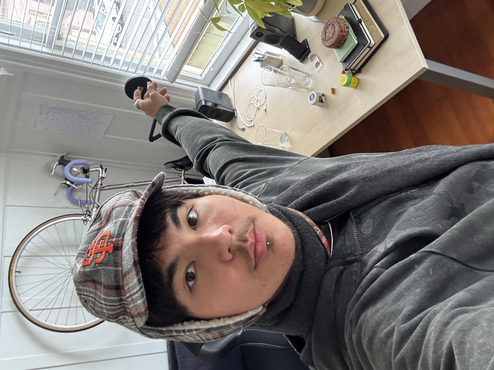

may 2026 takeaways:

- being able to have it all is not a reason to have it all, maximalism is not my path, man's search for meaning continues.
- i am so grateful for my body that can run and dance and climb and move and walk. it's a temple and i should attend to it as such. 
- it's really easy and intoxicating to believe you're in control of your destiny. your blessings come from Allah, remember that.
- remember ur young ho and chopped unc, a fool and also an alien of extraordinary ability. remember to be human is to hold and embrace your contradictions.

