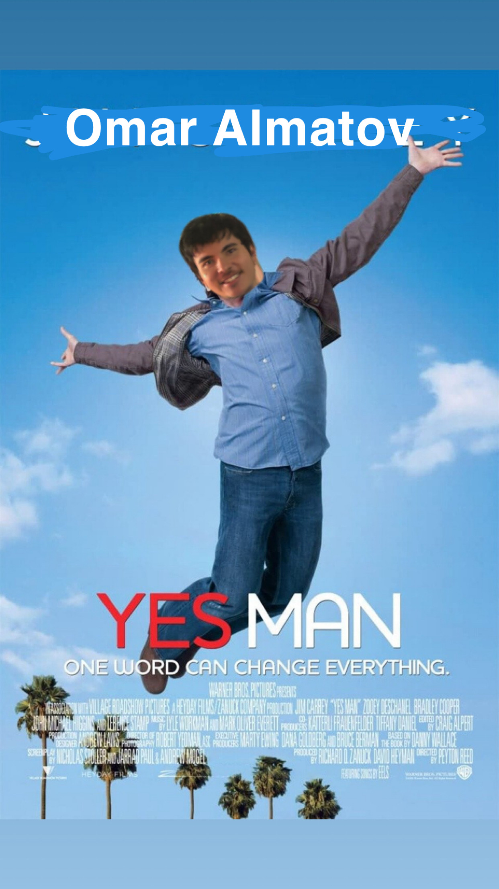
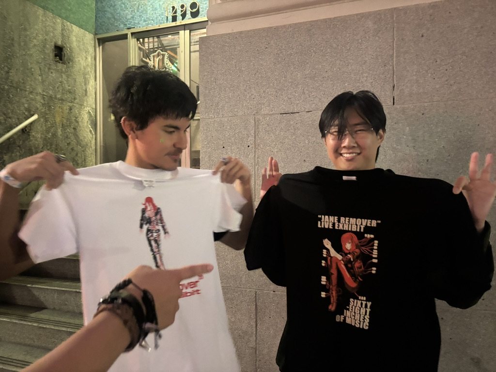
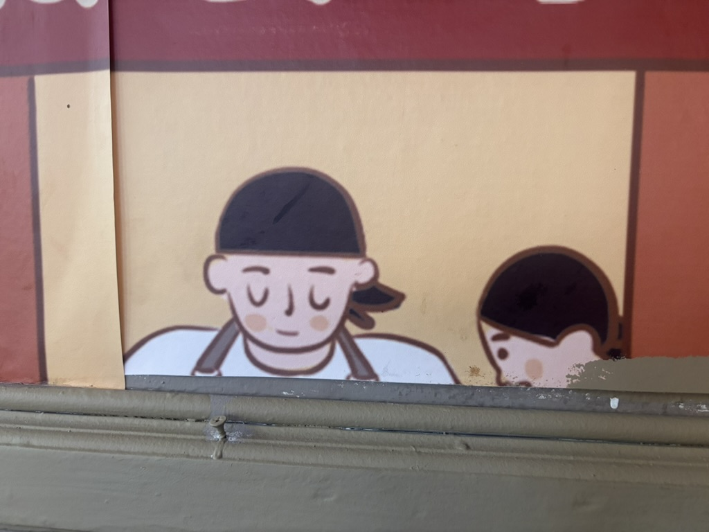
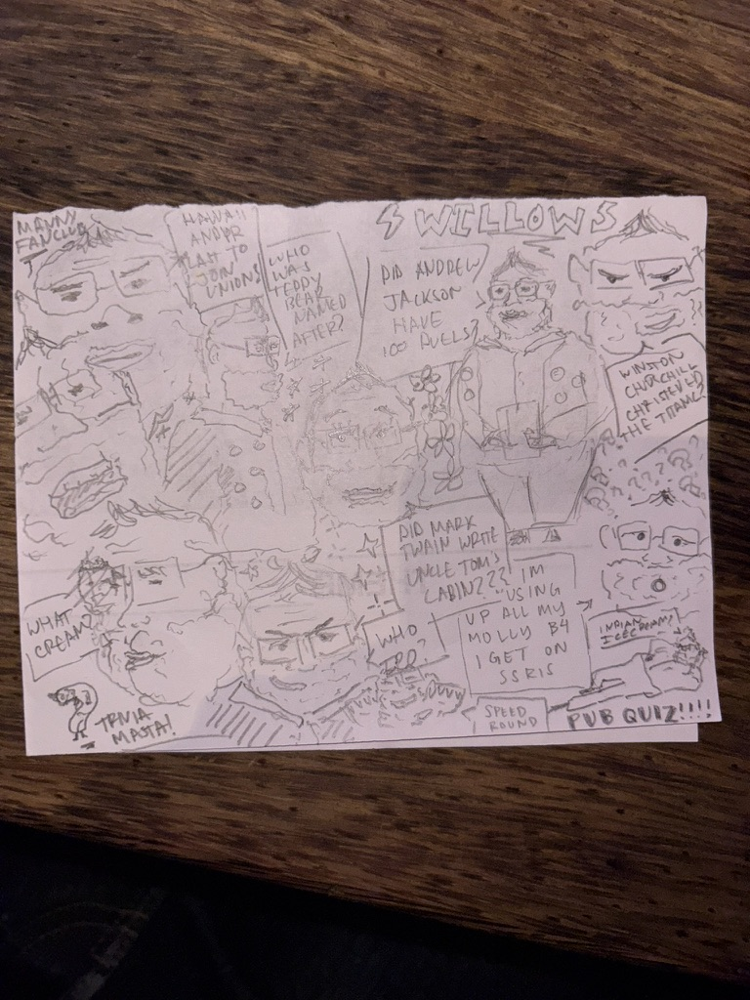

saw jane remover... 4/10 show... it's time to retire.

went to trivia for the first time, didn't know the answers to any questions and ended up drawing doodles of the trivia master. he asked if he can keep the drawing and i happily gifted it to him.

working on so many exciting things. working many many hours. lots of late nights. i am convinced again that i have that dog in me (even though i am a cat intrinsically). 

i feel so close to ranking up. not monetarily or career wise, but there's going to be some kind of big shift: a metamorphisis. i just need to finish the year strong. i'll rest and recover in the winter.

side note: i am once again resuming my cynisism about love. a wise mango has warned me. that shit's super wack and fake and fugazi and stinky. i want nothing to do with that.




