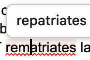
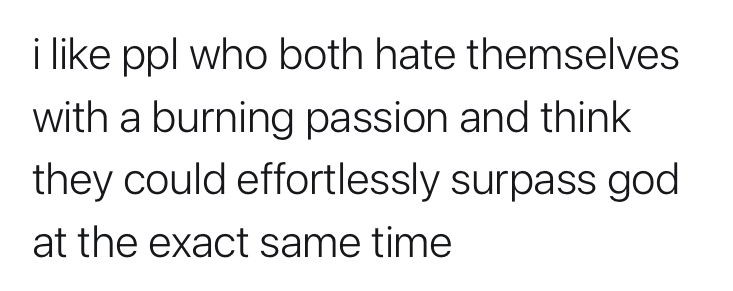
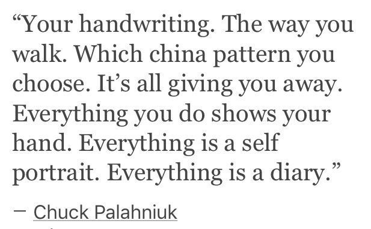

some things i came across whilst browsing the internet

from [monsterousseas](https://monsterousseas.neocities.org):





a really good essay from pol clarissou i found on [sadgrl](https://sadgrl.online/)'s website: [To Save Art We Must Kill The Artist](https://polclarissou.com/boudoir/posts/2022-01-20-To-save-the-arts-we-must-kill-the-artist.html). articulates exactly how i feel about big city aRtISTs.
