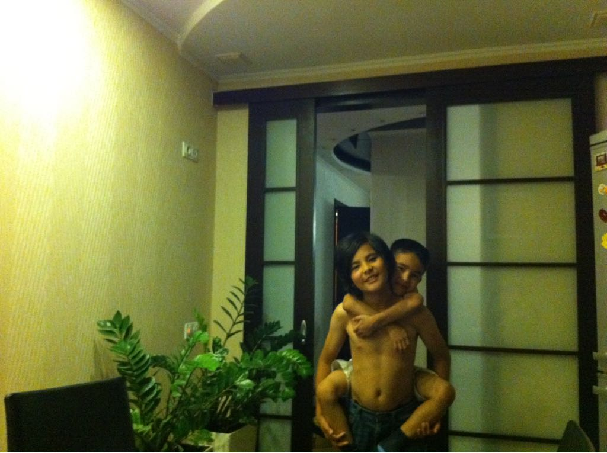

"So how is it out there?"

Oh it’s desolate. Atomized. Cleaned up and neatly organized. Like a freshly watered potus hanging from the ceiling of a bourgeois middle class apartment. 

My warm socks oppress me, the sweet smell of incense cedar makes me nauseous, and this soft king size bed makes my back hurt. 

Time with friends is only a temporary remedy like drugs and alcohol. Drugs and alcohol only a temporary remedy in place of stepping out to breathe. Because how can I step outside in this weather? This temperate San Francisco weather? Everyday is like the Truman show. The schizophrenic’s nightmare. Sister wouldn’t even last a day out here. 

Oh mother what good does it do that I survived if survival means dying slowly in this miserable ease? What good does it do that I survived, if I’m now so weak that the weightlessness of this cosmic irony on my shoulders is making them bleed?

Maybe Esther should’ve just opened that bell jar? Maybe all Harry Haller needed was to learn how to dance? But I’ll tell you I’ve danced and all I got was strange looks and loud whispers from people who must know something I don't about how to be.

There I go again talking to ghosts. 

I’m in my childhood room where I go again talking to ghosts. 

